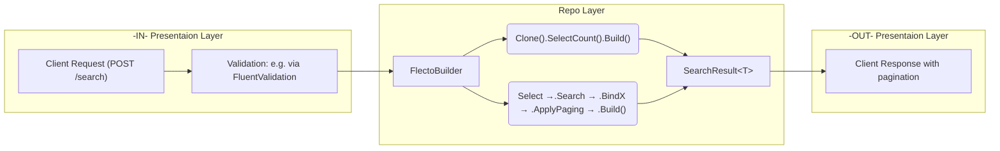
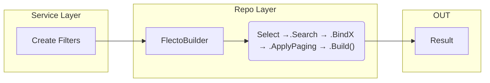

## Usages

This section demonstrates practical usage patterns of the Flecto library in real applications. 
From simple filter binding to executing queries and returning paginated results, 
this guide covers typical end-to-end flows.

---

### 1. Full Request-Response Flow
This is the most common scenario in web APIs. 
A client sends a request, filters are validated, and a dynamic SQL query is built using Flecto 
and executed via Dapper.



Example:
```csharp
// Request.cs

public class Request
{
    public SearchFilter? Search { get; set; }
    public StringFilter? Name { get; set; }
    public NumericFilter<decimal>? Salary { get; set; }
    public PaginationFilter? Paging { get; set; }
}

// Response.cs

public class Response
{
    public SearchResult<Employee[]>? Data { get; set; }
}

// Controller.cs
//...
[HttpPost("PostSearch")]
public async Task<ActionResult<Response>> PostSearch(
    Request r, 
    CancellationToken token)
{
    var result = await _svc.Search(r, token);
    return Ok(new Response { Data = result });
}
//...

// Validator.cs
// ... e.g. FluentValidation
// ...
RuleFor(x => x.BoolFilter)
    .Custom((filter, context) =>
    {
        var errors = GetBoolFilterValidationErrors(filter, requireAtLeastOne: false);

        foreach (var error in errors)
        {
            context.AddFailure(error.Field, error.Error);
        }
    });
// ...

// Repository.cs
// ...
// ...


private readonly FromTable _tc = new FromTable(
    table: _employeeTable,
    fields: new Field[]{
        new Field("id"),
        new Field("social_networks->'is_active'", "social_networks_is_active")
});

public async Task<SearchResult<Employee[]>> Search(Request r, CancellationToken token)
{
    var builder = new FlectoBuilder(_employeeTable, DialectType.Postgres)
        .Search(r.Search, "first_name", "last_name", "middle_name", "notes")
        .BindNumeric(r.Id, "id")
        .BindString(r.Name, "first_name")
        .BindNumeric(r.Salary, "salary");

    var (sqlCount, parametersCount) = builder
        .Clone()
        .SelectCount()
        .Build();

    using var connection = await CreateConnectionAsync();

    var totalRecords = await connection.QueryFirstAsync<int>(sqlCount, parametersCount);

    var (sql, parameters) = builder
        .Select(_tc)
        .ApplyPaging(r.Paging)
        .Build();

    var employees = await connection.QueryAsync<Employee>(sql, parameters);

    return new SearchResult<Employee[]>(
            employees.ToArray(),
            SearchMetadata.From(totalRecords, r.Paging));
}

```

### 2. Service-Layer Query Flow


Example:
```csharp
// Service.cs

// ...

public async Task<Employee> GetEmployee(long id, CancellationToken token)
{
    var f = new NumericFilter<long> { Eq = id };
    result = await _repo.GetEmployee(f, token);
}

// ...

// Repository.cs

// ...

public async Task<Employee> GetEmployee(NumericFilter<long> f, CancellationToken token)
{
    var builder = new FlectoBuilder(_employeeTable, DialectType.Postgres)
        .Select(_employeeAllColumn)
        .BindNumeric(r.Id, "id")

    using var connection = await CreateConnectionAsync();
    var employees = await connection.QueryAsync<Employee>(sql, parameters);

    return employees.FirstOrDefault();
}

// ...

```
---
